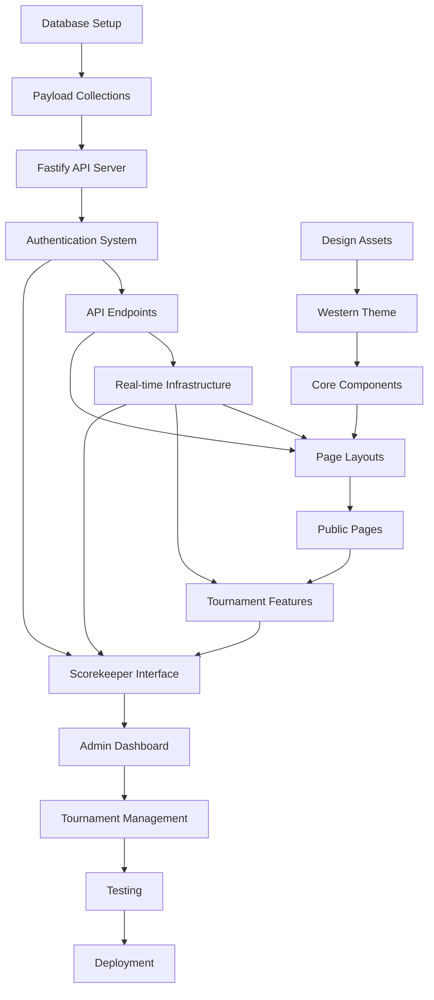

# Cowtown Showdown - Project Roadmap & Dependencies

## Executive Summary

This roadmap outlines the development phases for the Cowtown Showdown tournament website, a comprehensive lacrosse tournament management platform built on Payload CMS, Next.js, and Fastify. The project is organized into 4 main phases over 8 weeks.

## Technology Stack

- **CMS**: Payload CMS 3.x
- **Frontend**: Next.js 15 (App Router)
- **API Layer**: Fastify
- **Database**: PostgreSQL
- **Real-time**: Server-Sent Events (SSE) & WebSockets
- **Cache**: Redis
- **Styling**: Tailwind CSS + Western Theme
- **Deployment**: Docker + Kubernetes/Coolify

## Development Phases

### Phase 1: Foundation & Data Layer (Weeks 1-2)

#### Week 1: Backend Infrastructure ✅ **COMPLETED**
**Tasks**:
1. ~~Set up Fastify API server structure~~ (Next.js API routes used instead)
2. ~~Implement authentication system with JWT~~ (Payload auth used)
3. ✅ Create tournament collections (Teams, Players, Games)
4. ✅ Set up access control and permissions
5. ~~Configure Redis for caching~~ (deferred to real-time phase)

**Dependencies**:
- ✅ PostgreSQL database setup
- ~~Redis server~~ (deferred)
- ✅ Payload CMS configuration

**Deliverables**:
- ✅ Working Payload CMS with tournament collections
- ✅ Basic CRUD operations for all collections
- ✅ Access control (public read, admin write)
- ✅ 5-point tournament system implementation

#### Week 2: Extended Data Models & API ✅ **PARTIALLY COMPLETED**
**Tasks**:
1. ✅ Create game-related collections (Goals, Penalties, Shots, Faceoffs)
2. 🔄 Implement all API endpoints (Next.js API routes, in progress)
3. 🔄 Set up SSE infrastructure for real-time updates (pending)
4. ✅ Create data validation schemas (built into Payload collections)
5. 🔄 Implement audit logging (deferred)

**Dependencies**:
- ✅ Phase 1 Week 1 completion
- 🔄 Real-time infrastructure setup

**Deliverables**:
- ✅ Complete tournament data model (8 core collections)
- ✅ Payload CMS admin interface
- ✅ Data validation and relationships
- 🔄 Real-time event system (pending)

### Phase 2: Frontend & UI Development (Weeks 3-4)

#### Week 3: Western Theme & Core Pages
**Tasks**:
1. Implement western design system
2. Create layout components (Header, Footer)
3. Build homepage with live scoreboard
4. Develop schedule and standings pages
5. Create team listing and profile pages

**Dependencies**:
- Design assets (fonts, textures, images)
- API endpoints from Phase 1

**Deliverables**:
- Western-themed UI components
- 5 core public pages
- Responsive layouts
- Basic navigation

#### Week 4: Tournament Features & Components
**Tasks**:
1. Build game detail pages with live updates
2. Create statistics pages and leaderboards
3. Implement team registration form
4. Develop all tournament-specific components
5. Add Payload CMS content blocks

**Dependencies**:
- Phase 2 Week 3 completion
- Real-time API endpoints

**Deliverables**:
- Complete public website
- All tournament UI components
- Content management blocks
- Form submissions

### Phase 3: Live Scoring & Management (Weeks 5-6)

#### Week 5: Scorekeeper Interface ✅ **COMPLETED**
**Tasks**:
1. ✅ Build mobile-optimized scorekeeper app
2. ✅ Implement game management features
3. ✅ Create stat entry interfaces
4. ✅ Add offline support with sync
5. ✅ Implement period timer management

**Dependencies**:
- ✅ Authentication system
- ✅ Real-time infrastructure
- ✅ Mobile testing devices

**Deliverables**:
- ✅ Complete scorekeeper interface
- ✅ Offline functionality with queue and sync
- ✅ Real-time score updates via SSE
- ✅ Mobile-optimized UI with 44px touch targets
- ✅ RMLL penalty system integration
- ✅ Three stars selection system
- ✅ Game claiming/releasing functionality
- ✅ Period management and timer controls

**Implementation Details**:
- **Components**: 10 new scorekeeper components with full TypeScript
- **API Endpoints**: 4 new real-time endpoints for game management
- **UI Libraries**: Added Radix UI components for accessibility
- **Authentication**: Enhanced auth system with game assignment validation
- **Real-time**: SSE implementation with automatic reconnection
- **Mobile UX**: Touch-optimized interface for tablet scorekeepers
- **Tournament Rules**: Full RMLL compliance with 5-point scoring system
- **Documentation**: Comprehensive scorekeeper user guide created

#### Week 6: Tournament Management
**Tasks**:
1. Create admin dashboard
2. Build schedule generation system
3. Implement bracket management
4. Add team approval workflow
5. Create reporting features

**Dependencies**:
- All collections and APIs
- Scorekeeper interface

**Deliverables**:
- Admin management tools
- Automated scheduling
- Bracket visualization
- Export capabilities

### Phase 4: Testing & Launch (Weeks 7-8)

#### Week 7: Testing & Optimization
**Tasks**:
1. Performance optimization
2. Load testing (500-900 users)
3. Mobile device testing
4. Security audit
5. Bug fixes and refinements

**Dependencies**:
- Complete feature set
- Testing infrastructure

**Deliverables**:
- Performance report
- Security audit results
- Bug fix log
- Optimized codebase

#### Week 8: Deployment & Launch
**Tasks**:
1. Production deployment setup
2. Data migration and import
3. User training (scorekeepers, admins)
4. Launch preparation
5. Post-launch monitoring

**Dependencies**:
- Production infrastructure
- Domain and SSL certificates
- Trained users

**Deliverables**:
- Live production site
- Training documentation
- Monitoring dashboards
- Launch checklist

## Task Dependencies Graph

## Resource Allocation

### Development Team
- **Backend Developer**: Collections, API, real-time system
- **Frontend Developer**: UI components, pages, responsive design
- **Full-stack Developer**: Scorekeeper interface, admin tools
- **UI/UX Designer**: Western theme, component design
- **DevOps Engineer**: Infrastructure, deployment, monitoring

### Parallel Development Opportunities
1. **Backend & Design**: Can work simultaneously in Week 1
2. **API & Frontend Components**: Parallel development with mocked data
3. **Public Pages & Admin Tools**: Different developers can work concurrently
4. **Mobile & Desktop**: Separate testing tracks

## Risk Mitigation

### Technical Risks
1. **Real-time Performance**
   - Mitigation: Early load testing, Redis caching, horizontal scaling
   
2. **Mobile Compatibility**
   - Mitigation: Progressive enhancement, extensive device testing
   
3. **Offline Functionality**
   - Mitigation: Service workers, IndexedDB, sync strategies

### Schedule Risks
1. **API Delays**
   - Mitigation: Mock data for frontend development
   
2. **Design Asset Delays**
   - Mitigation: Use placeholder assets, progressive enhancement
   
3. **Testing Discoveries**
   - Mitigation: Continuous testing, 2-week buffer

## Success Metrics

### Technical Metrics
- Page load time < 3 seconds
- Real-time update latency < 500ms
- 99.9% uptime during tournament
- Support 500-900 concurrent users

### Feature Completeness
- [x] Core tournament collections implemented (8/11 collections complete)
  - [x] Teams collection with captain info and branding
  - [x] Players collection with roster management
  - [x] Games collection with 5-point tournament system
  - [x] Goals collection with scoring events
  - [x] Penalties collection with RMLL infractions
  - [x] Faceoffs collection for statistics
  - [x] Shots collection for goaltender stats
  - [x] LooseBalls collection for possession tracking
  - [ ] TeamStaff collection (pending)
  - [ ] GoalieChanges collection (pending)
  - [ ] TournamentYears collection (pending)
- [ ] 30+ API endpoints functional
- [ ] 8 public pages complete
- [ ] Scorekeeper interface tested
- [ ] Admin tools operational

### Quality Metrics
- [ ] Zero critical bugs
- [ ] Mobile responsive on all devices
- [ ] WCAG 2.1 AA compliant
- [ ] Security audit passed

## MVP Definition

### Core Features (Must Have)
1. Team and player management
2. Live scoring system
3. Public scoreboard and standings
4. Scorekeeper interface
5. Basic admin tools

### Enhanced Features (Nice to Have)
1. Historical statistics
2. Advanced analytics
3. Push notifications
4. Video integration
5. Merchandise store

## Post-Launch Roadmap

### Month 1
- Performance monitoring
- User feedback collection
- Bug fixes and patches
- Content updates

### Month 2-3
- Feature enhancements
- Mobile app consideration
- API documentation
- Third-party integrations

### Future Considerations
- Multi-tournament support
- Ticket sales integration
- Live streaming platform
- Advanced statistics dashboard

## Conclusion

This roadmap provides a structured approach to building the Cowtown Showdown tournament platform. The phased approach allows for parallel development, early testing, and risk mitigation while ensuring all critical features are delivered on time.

Key success factors:
1. Clear communication between team members
2. Regular testing and feedback cycles
3. Flexibility to adjust based on discoveries
4. Focus on mobile-first, performance-oriented development

The modular architecture using Payload CMS, Next.js, and Fastify provides a solid foundation for future enhancements and scalability.