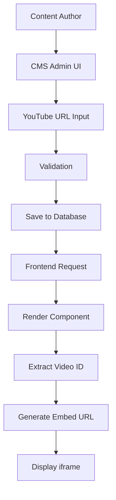

# YouTube Embed Developer Guide

## Overview

The YouTube embed block is a custom Payload CMS block that allows content authors to embed YouTube videos and live streams into pages. This guide covers the technical implementation, architecture, and development practices for the YouTube embed feature.

## Architecture

### Component Structure

```
src/
├── blocks/
│   └── YouTubeEmbed/
│       ├── config.ts         # Payload block configuration
│       ├── Component.tsx     # React component
│       └── Component.stories.tsx # Storybook stories
├── lib/
│   └── youtube/
│       ├── index.ts          # Public API exports
│       ├── extractVideoId.ts # Video ID extraction logic
│       ├── validateUrl.ts    # URL validation utilities
│       └── getEmbedUrl.ts    # Embed URL generation
└── payload-types.ts          # Generated TypeScript types
```

### Data Flow



## Implementation Details

### Block Configuration

The block is configured in `src/blocks/YouTubeEmbed/config.ts`:

```typescript
export const YouTubeEmbed: Block = {
  slug: 'youtubeEmbed',
  interfaceName: 'YouTubeEmbed',
  fields: [
    {
      name: 'url',
      type: 'text',
      required: true,
      validate: (value) => {
        // Custom validation logic
      }
    },
    // Additional fields...
  ]
}
```

### Component Implementation

The React component handles:
1. URL validation and video ID extraction
2. Responsive iframe rendering
3. Loading and error states
4. Privacy-enhanced mode

Key features:
- Lazy loading for performance
- Aspect ratio preservation
- Error boundaries
- Accessibility compliance

### Utility Functions

#### `extractVideoId(url: string): string | null`
Extracts video ID from various YouTube URL formats:
- Standard: `youtube.com/watch?v=VIDEO_ID`
- Short: `youtu.be/VIDEO_ID`
- Embed: `youtube.com/embed/VIDEO_ID`
- Live: `youtube.com/live/VIDEO_ID`

#### `validateYouTubeUrl(url: string): boolean`
Validates URL format using comprehensive regex patterns.

#### `getEmbedUrl(videoId: string, options: YouTubeEmbedOptions): string`
Generates embed URL with customizable parameters:
- Autoplay, mute, controls
- Privacy-enhanced mode
- Start/end times
- UI customization

## Integration Points

### 1. Payload CMS Integration

The block is registered in `src/collections/Pages/index.ts`:

```typescript
blocks: [
  // Other blocks...
  YouTubeEmbed
]
```

### 2. Frontend Rendering

The block is rendered via `src/blocks/RenderBlocks.tsx`:

```typescript
const blockComponents = {
  // Other blocks...
  youtubeEmbed: YouTubeEmbed,
}
```

### 3. TypeScript Types

After adding the block, regenerate types:
```bash
pnpm payload generate:types
```

This creates the `YouTubeEmbed` interface in `payload-types.ts`.

## API Reference

### YouTubeEmbed Component Props

```typescript
interface YouTubeEmbedProps {
  url: string                    // Required YouTube URL
  title?: string                 // Optional title
  autoplay?: boolean            // Default: false
  muted?: boolean               // Default: true
  showControls?: boolean        // Default: true
  aspectRatio?: '16:9' | '4:3' | '21:9' | '1:1'
  privacyEnhanced?: boolean     // Default: true
  className?: string            // Additional CSS classes
}
```

### YouTube Utility Functions

```typescript
// Extract video ID from URL
extractVideoId(url: string): string | null

// Validate YouTube URL format
validateYouTubeUrl(url: string): boolean

// Check if URL is a live stream
isYouTubeLiveUrl(url: string): boolean

// Generate embed URL with options
getEmbedUrl(
  videoId: string, 
  options?: YouTubeEmbedOptions
): string

// Get video thumbnail URL
getYouTubeThumbnail(
  videoId: string, 
  quality?: 'default' | 'medium' | 'high' | 'maxres'
): string
```

## Development Workflow

### Adding YouTube Embed to a Page Type

1. Import the block config:
```typescript
import { YouTubeEmbed } from '@/blocks/YouTubeEmbed/config'
```

2. Add to blocks array:
```typescript
blocks: [...existingBlocks, YouTubeEmbed]
```

3. Regenerate types:
```bash
pnpm payload generate:types
```

### Creating Custom YouTube Components

Example: Live game stream component

```typescript
import { extractVideoId, getLiveEmbedUrl } from '@/lib/youtube'

export function GameLiveStream({ game }: { game: Game }) {
  const videoId = extractVideoId(game.youtubeUrl)
  
  if (!videoId) return null
  
  const embedUrl = getLiveEmbedUrl(videoId, {
    autoplay: true,
    mute: true,
  })
  
  return (
    <div className="aspect-video">
      <iframe
        src={embedUrl}
        title={`Live: ${game.homeTeam.name} vs ${game.awayTeam.name}`}
        className="w-full h-full"
        allowFullScreen
      />
    </div>
  )
}
```

### Implementing Live Game Detection

For homepage integration:

```typescript
// In src/app/(frontend)/page.tsx
const liveGame = games.find(game => 
  game.status === 'live' && game.youtubeUrl
)

// Pass to client component
<TournamentHomepage
  liveGameUrl={liveGame?.youtubeUrl}
/>

// In client component
{liveGameUrl && (
  <section className="mb-8">
    <h2>Live Now</h2>
    <YouTubeEmbed
      url={liveGameUrl}
      autoplay={true}
      muted={true}
    />
  </section>
)}
```

## Performance Considerations

### 1. Lazy Loading

The component uses `loading="lazy"` on iframes to defer loading until needed.

### 2. Thumbnail Optimization

For better perceived performance, consider showing thumbnails first:

```typescript
const [showVideo, setShowVideo] = useState(false)
const videoId = extractVideoId(url)
const thumbnail = getYouTubeThumbnail(videoId, 'high')

if (!showVideo) {
  return (
    <button onClick={() => setShowVideo(true)}>
      
      <PlayIcon />
    </button>
  )
}
```

### 3. Resource Hints

Add to document head for faster YouTube loads:

```html
<link rel="preconnect" href="https://www.youtube-nocookie.com">
<link rel="dns-prefetch" href="https://www.youtube-nocookie.com">
```

## Security Considerations

### 1. URL Validation

Always validate URLs server-side:

```typescript
// In collection hook
beforeChange: async ({ data }) => {
  if (data.youtubeUrl && !validateYouTubeUrl(data.youtubeUrl)) {
    throw new Error('Invalid YouTube URL')
  }
  return data
}
```

### 2. Content Security Policy

Update CSP headers to allow YouTube embeds:

```typescript
// In next.config.js or middleware
const cspHeader = `
  frame-src 
    'self' 
    https://www.youtube.com 
    https://www.youtube-nocookie.com;
`
```

### 3. Privacy Mode

Default to privacy-enhanced mode:
- Uses `youtube-nocookie.com` domain
- Reduces tracking cookies
- Complies with privacy regulations

## Error Handling

### Component Error Boundaries

```typescript
class YouTubeEmbedErrorBoundary extends React.Component {
  state = { hasError: false }
  
  static getDerivedStateFromError() {
    return { hasError: true }
  }
  
  render() {
    if (this.state.hasError) {
      return <div>Failed to load video</div>
    }
    return this.props.children
  }
}
```

### Network Error Handling

```typescript
const [error, setError] = useState<Error | null>(null)

<iframe
  onError={() => setError(new Error('Failed to load video'))}
  // ...other props
/>
```

## Testing Strategies

### Unit Testing

```typescript
describe('YouTube utilities', () => {
  test('extractVideoId handles all URL formats', () => {
    const urls = [
      'https://www.youtube.com/watch?v=dQw4w9WgXcQ',
      'https://youtu.be/dQw4w9WgXcQ',
      'https://www.youtube.com/embed/dQw4w9WgXcQ',
    ]
    
    urls.forEach(url => {
      expect(extractVideoId(url)).toBe('dQw4w9WgXcQ')
    })
  })
})
```

### Integration Testing

```typescript
test('YouTube embed renders in page', async () => {
  const page = await payload.create({
    collection: 'pages',
    data: {
      title: 'Test Page',
      layout: [{
        blockType: 'youtubeEmbed',
        url: 'https://www.youtube.com/watch?v=dQw4w9WgXcQ',
      }]
    }
  })
  
  expect(page.layout[0].blockType).toBe('youtubeEmbed')
})
```

## Debugging Tips

### 1. Console Logging

Enable debug mode in development:

```typescript
const DEBUG = process.env.NODE_ENV === 'development'

if (DEBUG) {
  console.log('YouTube embed:', { videoId, embedUrl })
}
```

### 2. React DevTools

Inspect component props and state:
- Check extracted video ID
- Verify embed URL parameters
- Monitor loading states

### 3. Network Inspector

Verify iframe requests:
- Check CSP headers
- Confirm privacy mode domain
- Monitor API calls

## Future Enhancements

### 1. Playlist Support

```typescript
interface YouTubePlaylistEmbed {
  playlistId: string
  startIndex?: number
}
```

### 2. Analytics Integration

```typescript
// Track video interactions
onPlay={() => analytics.track('video_play', { videoId })}
onComplete={() => analytics.track('video_complete', { videoId })}
```

### 3. Adaptive Quality

```typescript
// Detect network speed and adjust quality
const quality = getNetworkQuality()
const embedUrl = getEmbedUrl(videoId, {
  quality: quality === 'slow' ? '360p' : 'auto'
})
```

## Troubleshooting

### Common Issues

1. **Video not loading**
   - Check CSP headers
   - Verify URL validation
   - Test network connectivity

2. **Autoplay not working**
   - Ensure muted=true for autoplay
   - Check browser autoplay policies

3. **Responsive issues**
   - Verify aspect ratio container
   - Test on actual devices

### Debug Checklist

- [ ] Valid YouTube URL?
- [ ] Video ID extracted correctly?
- [ ] CSP allows YouTube domains?
- [ ] Network requests successful?
- [ ] Console errors present?
- [ ] Component props correct?

## Resources

- [YouTube IFrame Player API](https://developers.google.com/youtube/iframe_api_reference)
- [YouTube Live Streaming API](https://developers.google.com/youtube/v3/live/getting-started)
- [Payload CMS Block Documentation](https://payloadcms.com/docs/fields/blocks)
- [Next.js CSP Guide](https://nextjs.org/docs/app/building-your-application/configuring/content-security-policy)